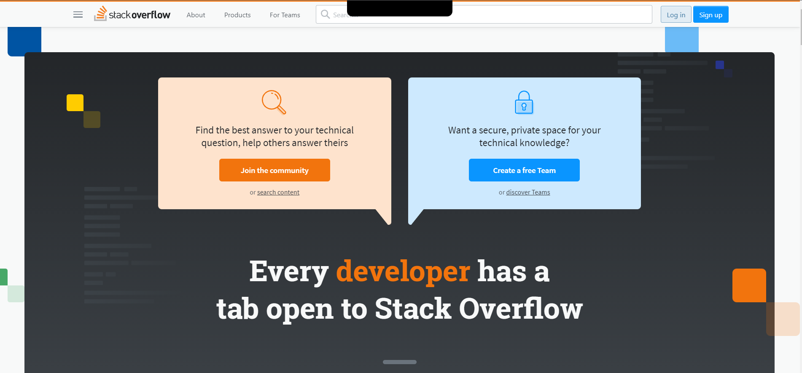

# Notch for everyone

Notch for everyone is a chrome extenstion that will place the notch for your website.

## How to Install ?

1. Clone or download this repository.
2. Navigate to chrome://extensions/
3. Click on 'Toggle the developer mode'.
4. Click on 'Load Unpacked'
5. Select the complete folder which you cloned or downloaded in the first step.
6. Now just click on the extenstion and use it.

## Tech Stack

- HTML
- CSS
- JavaScript
